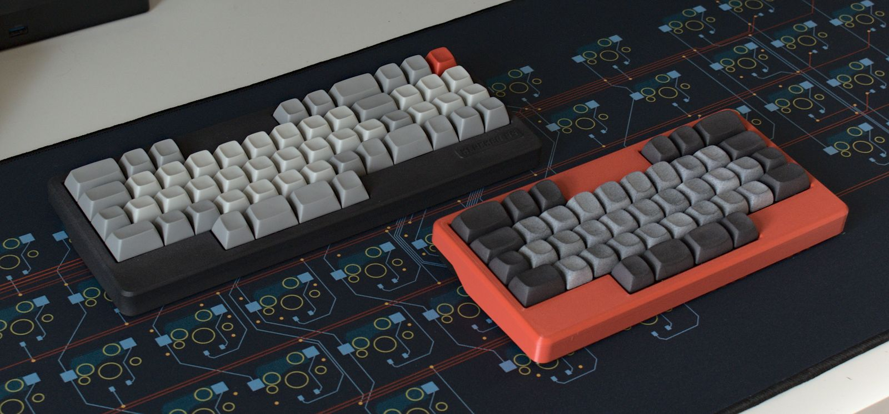
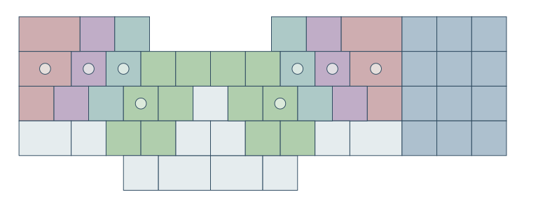
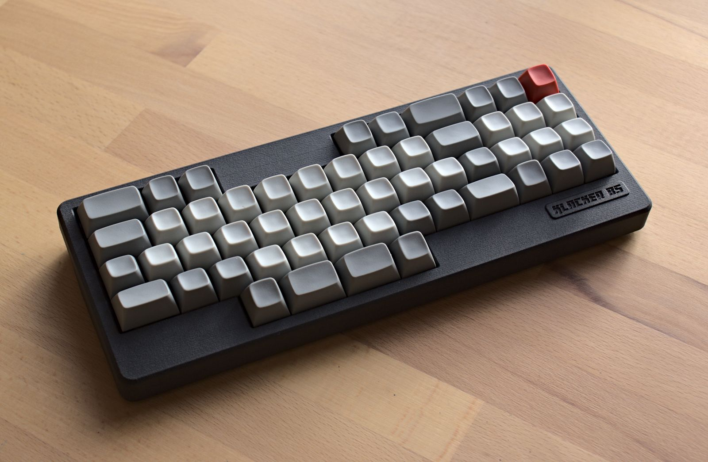
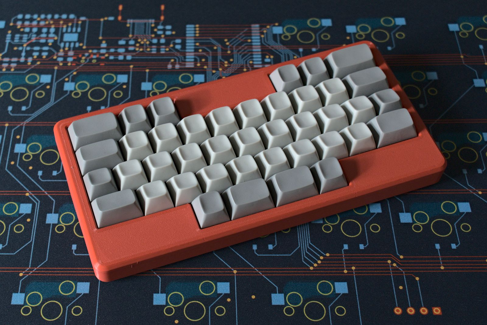

# Klacker_BS

a 3x5+2 split keyboard hidden in a row staggered unibody design w/ numpad

## Features

- MX hotswap
- compact design
- layout for comfortable typing, straight wrist and minimal fingermovement
- reversable pcb w/ numpad breakoff - Layout options: Numpad Right, Left or None
- Bluetooth and USB connection 
- case files are supplied (stl, step, as well as freecad files)
- ZMK firmware support

## Layout

Dots mark the home row. Colors indicate which finger is responsible for each key. It is essentially a 3x5+2 split and every keymap made for those will work on the Klacker. White keys except thumbs are free. I use the right ones as thumbkeys when I use the numpad.
It takes some time to adjust to the layout, but it is really comfortable to type on once the figers have adjusted.

## Want to build one?
You will find all production files needed to build your own [here](./prod).
I've included smt assembly files, but in the current times these might outdate quickly. If you can't figure out a replacement part, drop me a message and I will try to help out.

Case files can be found [here](./prod/case). The topside comes in two flavours. If you print at home with FDM printer, it might be better to use [prod/case/case_top_no_logo_FDM.stl](./prod/case/case_top_no_logo_FDM.stl). The top is completely flat and can be printed easily. If you use MJf or Resin use the other file

## cad data
Freecad source data for the case can be found [here](./cad_source). There are also step files if that's more helpful to you.
Plate can either be printed or made by your PCB manufacturer with the provided Kicad files.
Kicad data for plate and main pcb can be found [here](./pcb)

### firmware 
The Tipper TF uses ZMK firmware.

If you prefer the github workflow, you can find the zmk config for the Klacker BS [here](https://github.com/weteor/Klacker_BS-Config). 

## the rest
Everything in this repository is free to use however you might see fit. If you want to support me and my projects, please consider linking back to this repository if you build/change/use anything. 

If you would like to send me a tip, you could do it [here](https://ko-fi.com/weteor) (Please don't feel like you have to).

### pictures

